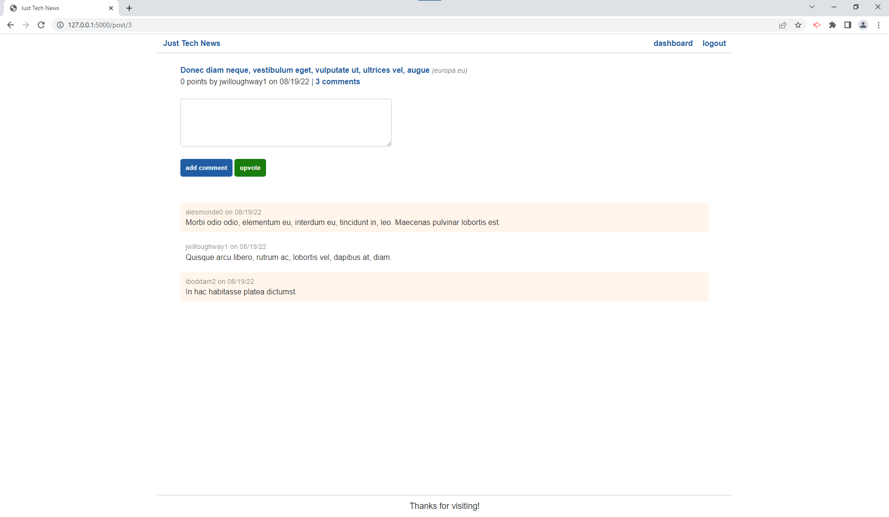

# Python newsfeed 

## Description

### What does Python newsfeed do?

This is an app refactored to use python and various libraries to handle the server-side functionality.


## Table of Contents

- [Installation](#installation)
- [Usage](#usage)
- [Credits](#credits)
- [Contribution](#contribution)
- [Questions](#questions)
- [Licence](#licence)

---

## Installation 

### Technologies Used in Development

Technologies used include:

This project uses Flask, SQLAlchemy, PyMySQL, bcrypt, python-dotenv, and Gunicorn, as well as html and javascript for the front-end.

### Installation Instructions

```md
Visit on Heroku!
```

## Usage



```md
Create a user and you can then create and comment on posts.
```

## Credits

Bootcamp provided the javascript and html, I wrote the rest.

## Contribution

Guidelines for contribution:

No contribution necessary.

## Questions

No contact


---
## Licence
This project is covered under the `Mit License`